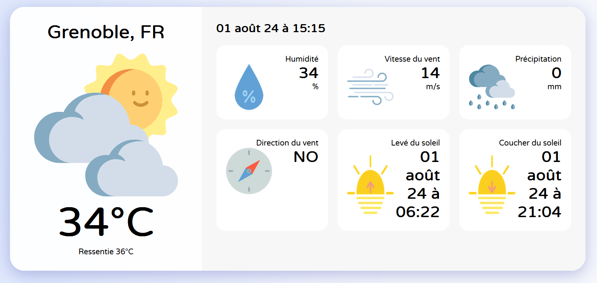

# Weather App

1. Entrer une ville sur un fichier et recevez les résultats de celle-ci

2. Météo heure par heure

3. Temperature et humidité

4. Direction et vitesse du vent

5. Coucher et lever de soleil

## Installation

  - git clone https://github.com/Salome-Bx/weather-app

  -  cd weather-app

  -  npm install

  -  Créer le .env.local en suivant les instructions du .env.exemple

  -  npm run dev

